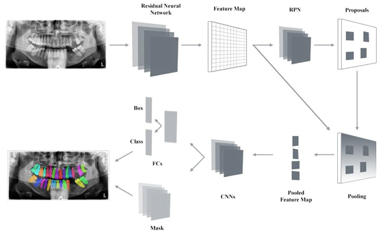
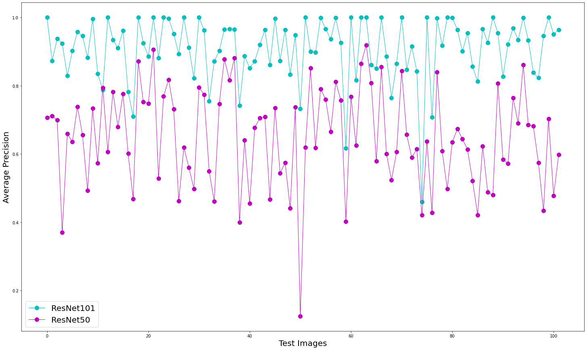

# Tooth Detection and Numbering with Instance Segmentation in Panoramic Radiographs

Deep neural networks have recently been used for detection and classification in medical imaging. Convolutional Neural Networks (CNN) is a neural network model that classifies images by processing various layers. Automatic detection of teeth in panoramic X-ray images is provided by computer-aided applications today. Panoramic radiology images, on the other hand, are frequently used by experts for diagnosis and analysis in the field of dentistry, due to the fact that they make each tooth visible by presenting a wide framed view of the mouth. Although panoramic radiology images are very important at the diagnosis stage, they may require a long time and require attention because the analysis is performed manually by a specialist. The main reason for this situation can be human errors such as fatigue, high stress level, mood changes, subjective opinion, inexperience. Aiming to reduce the workload of experts, a zone-based automatic segmentation system that segments each tooth with masks that will facilitate analysis is presented. The Mask R-CNN technique, which provides information about tooth pixels and tooth positions of interest, was used with ResNet-50 and ResNet-101 backbone networks for tooth detection and segmentation. The tooth numbering module classifies and numbering dental objects detected as a result of segmentation according to the FDI notation used universally by dentists. Designed system achieved a better result with the ResNet-101 backbone network with a precision of 96.42% and a F1-score of 93.97% for tooth numbering.

# Model

<figure>
<p align="center">
    
</p>
<figcaption align="center"><b>Figure 1: System architecture and model pipeline workflow.</b></figcaption>
</figure>


# Results


<figure>
<figcaption align="center"><b>Figure 2: Average precision results of ResNet50 and ResNet101 on each test images. </b></figcaption>
<p align="center">
    
</p>

</figure>


# Citation
If you use this research paper, please cite:

B.Y. Tekin, C. Ozcan, A. Pekince, Y. Yasa, A. Karaoglu, S. Cilek, D. Ozdemir, E. Meseci, Tooth Detection and Numbering with Instance Segmentation in Panoramic Radiographs, International Conference on Interdisciplinary Applications of Artificial Intelligence (ICIDAAI), 1st, Online, 21-23 May, 2021.

```
@inproceedings{tekin2021conference,
  title={Tooth Detection and Numbering with Instance Segmentation in Panoramic Radiographs},
  author={Tekin, Buse Yaren and Ozcan, Caner and Pekince, Adem and Yasa, Yasin and Karaoglu, Ahmet and Cilek, Suheda and Ozdemir, Dilara and Meseci, Elif},
  booktitle={2021 1st International Conference on Interdisciplinary Applications of Artificial Intelligence (ICIDAAI)},
  volume={1},
  pages={96--99},
  year={2021}
}
```

# Request Full Paper

Please click to access the conference paper; https://www.researchgate.net/publication/352226250_Tooth_Detection_and_Numbering_with_Instance_Segmentation_in_Panoramic_Radiographs
